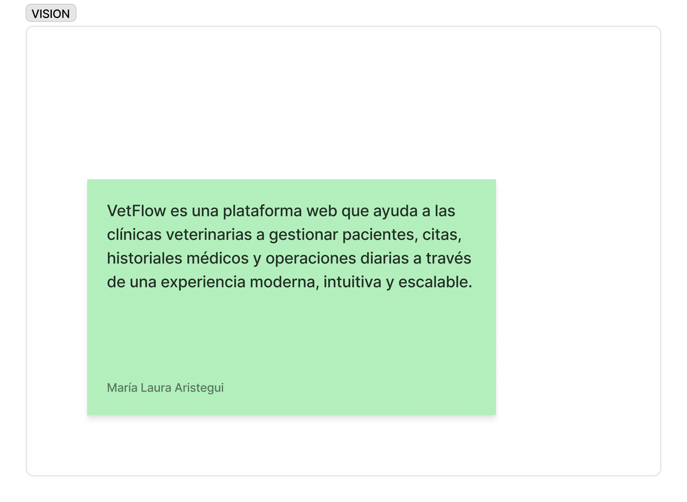
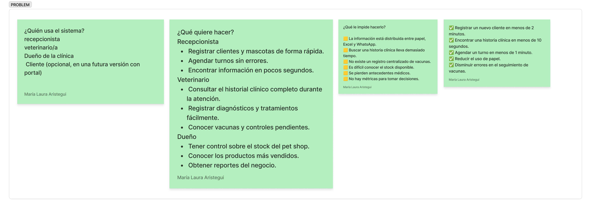
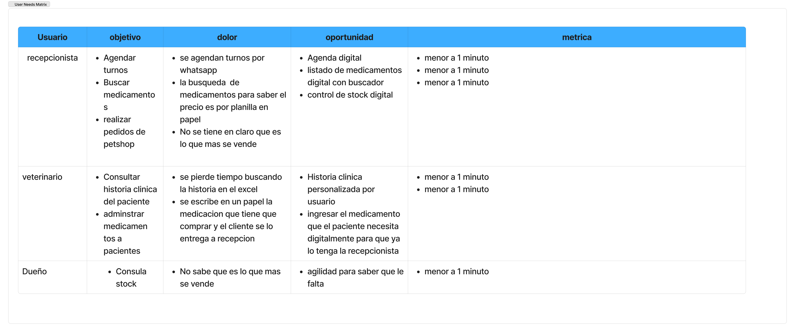
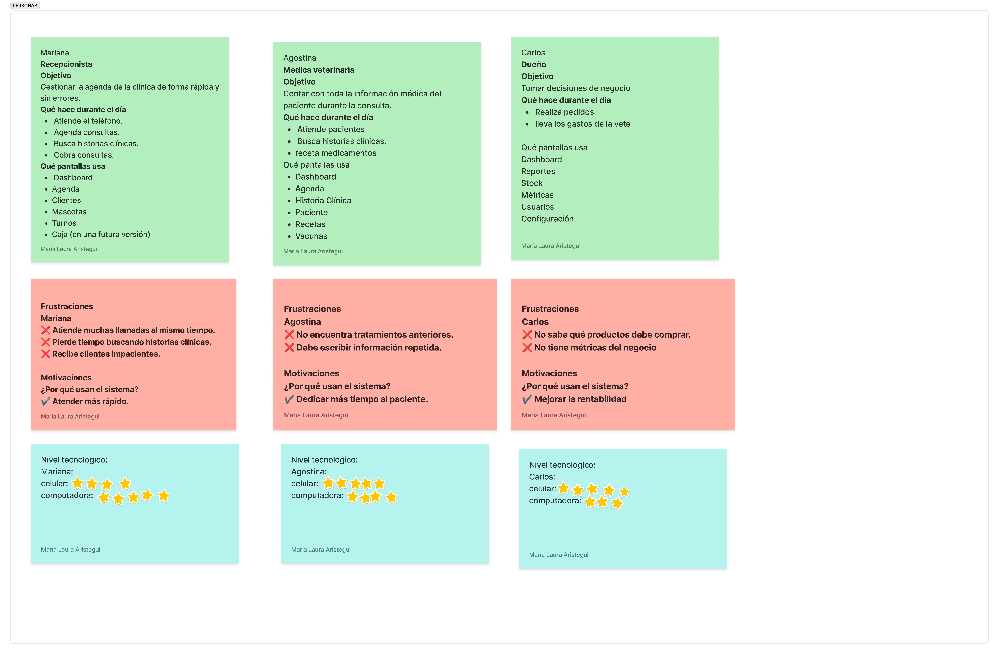
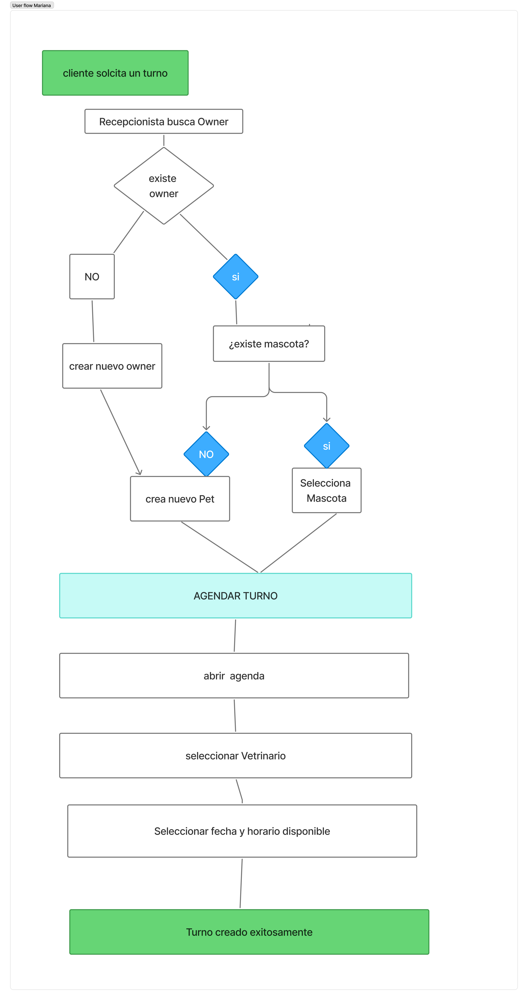

# 🐾 VeteApp

> 🚧 Proyecto en desarrollo — actualmente en etapa de diseño UX/UI.

VeteApp es una aplicación de gestión veterinaria diseñada y desarrollada
desde cero como proyecto personal.

El proyecto abarca el proceso completo de creación de producto:
**UX Research → UX Design → UI Design → Desarrollo.**

---

## 🎯 Visión del producto

El proceso comenzó con la definición de la visión del producto,
estableciendo el propósito y los principales objetivos de VeteApp.

---

## 🔎 Definición del problema

Se analizaron los principales problemas y necesidades que busca resolver
la aplicación.

---

## 👥 Necesidades de los usuarios

A partir del análisis inicial se identificaron las principales
necesidades de los usuarios de la plataforma.

---

## 👤 User Personas

Se definieron diferentes perfiles de usuario para comprender sus
objetivos, necesidades y puntos de dolor.

---

## 📋 Información del producto

Se definieron las principales características y funcionalidades
necesarias para responder a las necesidades identificadas.

---

## 🔄 Business Flow

Se diseñó el flujo general del negocio para representar las principales
acciones y decisiones dentro de la plataforma.

---

# 🗺️ User Journeys

Se analizaron los recorridos de diferentes perfiles de usuario,
identificando acciones, emociones, pain points y oportunidades de mejora.

### Mariana

### Agostina

### Carlos

---

# 🔀 User Flows

A partir de los User Journeys se diseñaron los flujos necesarios
para completar las principales tareas dentro de VeteApp.

### Mariana

### Agostina

🚧 En desarrollo.

### Carlos

🚧 En desarrollo.

---

## 🗺️ Estado del proyecto

- [x] Visión del producto
- [x] Definición del problema
- [x] Necesidades de usuario
- [x] User Personas
- [x] Información del producto
- [x] Business Flow
- [x] User Journeys
- [ ] User Flows
- [ ] Diseño UI
- [ ] Design System
- [ ] Prototipo
- [ ] Desarrollo Frontend
- [ ] Backend
- [ ] Testing
- [ ] Product Analytics
- [ ] Deploy

---

## 🎨 Próxima etapa

Actualmente estoy finalizando la etapa de **UX Design**.

El próximo paso será desarrollar la interfaz visual de VeteApp,
incluyendo el **Design System, componentes, pantallas y prototipo
interactivo en Figma**.
